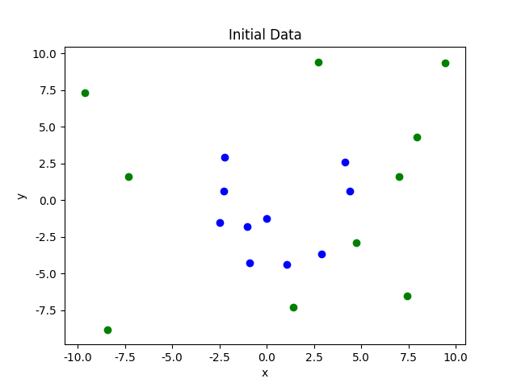
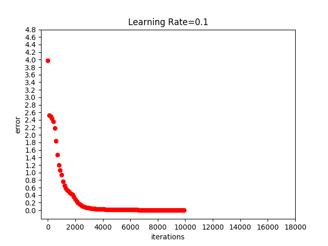
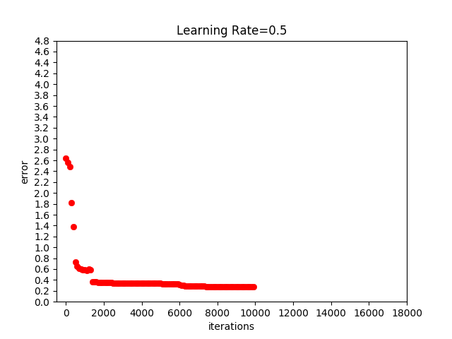
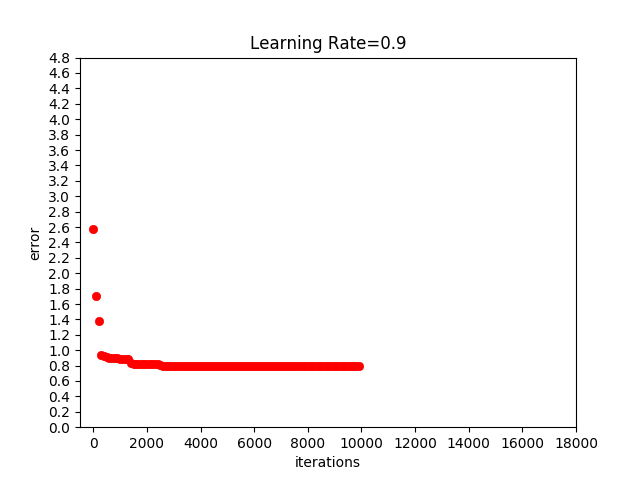
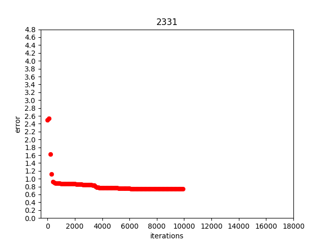
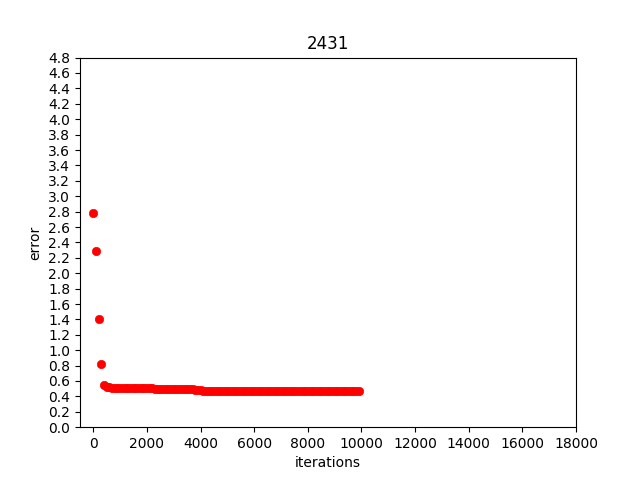
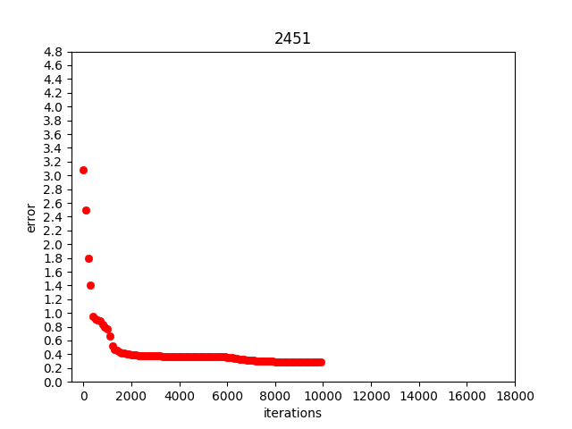

# BP

BP_NN.py是含有两个隐藏层的四层BP神经网络程序代码

随机产生以5为半径的圆内A和圆外B两类线性不可分数据

初始数据分布图：

分类结果：

输出接近1的表示属于A类，接近0的属于B类

学习率分别为0.1，0.5，0.9时的训练误差随迭代次数收敛情况：

根据调节学习率参数得到的结果及查阅资料可知，通常学习率越大，收敛速度越快，但学习率过大可能导致结果不收敛，学习率小则精度较大，但学习率过小收敛速度会较慢

节点数分别为（2，3，3，1），（2，4，3，1），（2，4，5，1）时训练误差随迭代次数收敛情况：

根据调节节点数参数得到的结果及查阅资料可知，在一定范围内节点数越多收敛效果越好，但节点数太大容易呈现出极大的随机性。
